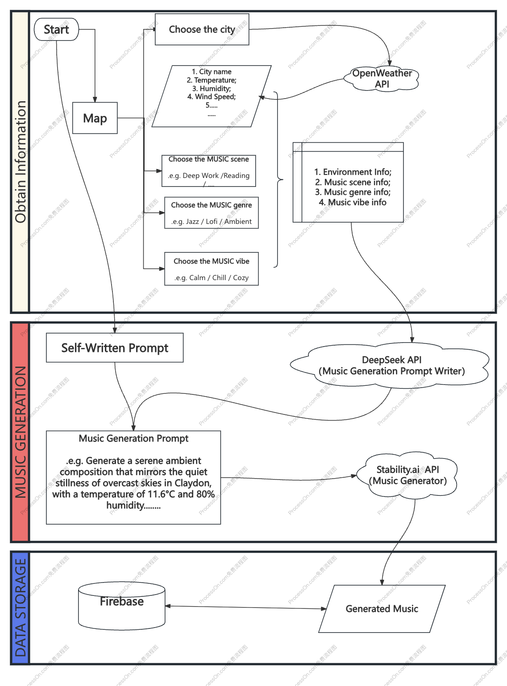

# EnviroMelody  

**Let your environment play the music.**  

## 🌐 Experience Now

Discover our [Offical Website](https://rorschachwilpeng.github.io/CASA0015_ENVIROMELODY/landing_page/index.html)，know more how EnviroMelody transform environment into personized music experience.

---

## 🔍 What is EnviroMelody?  
EnviroMelody is a mobile app that turns **real-time environmental data** — like temperature, humidity, and wind — into **custom soundtracks** tailored to your location and mood.  

Whether you're working, relaxing, or exploring, it creates adaptive audio that fits your moment.

---

## 🧠 Why Use It?  
- 📊 **Tired of charts?** Hear your environment instead.  
- 🎵 **Music apps guess your mood.** We read your surroundings.  
- 🖼️ **You remember sights.** We help you remember how a place *sounded*.

EnviroMelody bridges the gap between raw data and real emotion.

---

## ✨ Key Experiences  

### 🌇 **City Wanderer Mode**  
> "I walked through Berlin. It turned into synth."  
- Auto-detect location  
- Cultural vibe blending  
- Save and revisit your audio souvenirs  

### 🧘 **Zen Studio Mode**  
> "The weather outside made my room hum with calm piano."  
- Generates ambient tracks from local weather  
- Perfect for meditation, journaling, or deep focus  

### ⚡ **Storm Chaser Mode**  
> "The thunderstorm became a cinematic soundtrack."  
- Turns extreme weather into layered, dramatic scores  
- Great for creative work or storytelling  

---

## 🔉 Who's Using It?  
| User            | Use Case                             |  
|-----------------|--------------------------------------|  
| Digital Nomad   | *Collects soundtracks from travels*  |  
| Café Owner      | *Plays adaptive beats in shop*       |  
| Student         | *Listens to focus music shaped by current weather*  |  

---

## 🔗 What Makes It Different?  
- 🎼 Environment-based sound generation  
- 🧭 Location + weather = personalized music  
- 💾 Music saved with metadata (place, time, vibe)  
- 📍 Map your memories with music  

---

Ready to hear your world?  
> 🌦️ Open the map, select a place, and create your personal music.  

EnviroMelody — where every moment has a soundtrack.

---
## 🔧 Features

### 🗺️ Interactive Map
- Auto-locate or manually select any location  
- Place markers to generate music tied to specific places  
- Save and revisit favorite spots with associated soundscapes  

### 🌦️ Real-Time Environmental Data
- Fetch temperature, humidity, wind, and weather conditions  
- Live updates for current or selected location  
- Visual display of environmental metrics  

### 🎵 AI-Powered Music Generation
- Generate music based on environmental data  
- Customize mood and genre (e.g. Lofi, Jazz, Ambient)  
- Playback controls: loop, shuffle, queue  

### 📚 Music Library
- Save and manage generated tracks  
- Each track stores timestamp, location, and environment data  

---

## Tech Stack

### 💭 Workflow

### 📱 Frontend / App Development
- **Flutter**: Cross-platform framework for building consistent UI on iOS and Android  
- **Dart**: Primary programming language supporting the Flutter framework  
- **Provider**: Lightweight state management solution for reactive data handling  
- **just_audio**: Audio playback plugin with support for loop, queue, and background play  
- **flutter_map**: Map rendering and interaction using OpenStreetMap tiles  

### ☁️ Backend & Data Storage
- **Firebase**: Backend-as-a-Service for real-time data and cloud functions  
  - **Firestore**: Stores user data, music metadata, and environment logs  
  - **Firebase Storage**: Hosts generated audio files  
  - **Firebase Authentication**: Manages user sign-in and account access  
  - **Cloud Functions**: Executes backend logic as serverless functions  

### 📊 APIs & External Services
- **OpenWeatherMap API**: Provides real-time weather data (temp, humidity, wind)  
- **DeepSeek API**: Generates high-quality prompt structures for music creation  
- **Stability Audio API**: Main engine for generative ambient music  
- **Geocoding API**: Enables location search and coordinate transformation  

---
## 🎨 Design System & UI Philosophy

### Visual Style
EnviroMelody adopts a **pixel art-inspired** design, combining retro aesthetics with modern clarity for a unique, recognizable interface.

- **Color Palette**: Inspired by [Litverse Design Template](https://dribbble.com/shots/24962649-Litverse-Mobile-App-Design) — warm tones and soft contrasts for a calm, ambient mood.
- **Pixel Elements**:
  - Pixelated icons with modern readability
  - Grid-aligned layouts for visual consistency
  - Clean, simplified shapes and minimal gradients

----

## 🚀 **Join the Sound Revolution**  
  
**First 100 users get:**  
- Birthday weather song NFT  
- Soundmap co-creation access  

---

## 🌐 **Connect**  
  
  

--- 

**Transform your surroundings into a living soundtrack.**  
**#HearTheUnheard**  

--- 